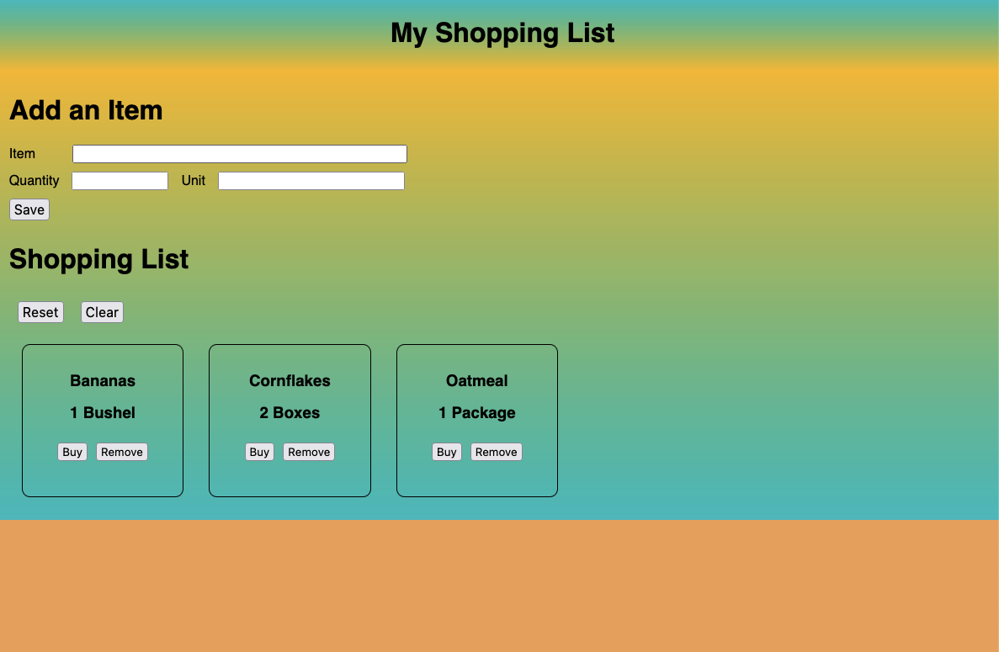

# Sunny Side Shopping Tracker

## Description

_Duration: 1.5 Day Sprint_

There are plenty of shopping lists out there in the world. One would be hard pressed to go out into the city and find someone that hasn't used a shopping list while taking on this endeavor. The issue with all of these shopping lists is that they make it feel like you are just doing another chore. Shopping is anything but a chore! A whole adventure of seeking out little products that define your lifestyle and perferences. So why should this feel like a chore?
If anything, it should feel as relaxing as sitting on the beach. With our simplicity and relaxing design, you'll find yourself making more and more trips to the store!

## Screen Shot

### Prerequisites

Link to software that is required to install the app (e.g. node).

- [Node.js](https://nodejs.org/en/)

## Installation

How do you get your application up and running? This is a step by step list for how another developer could get this project up and running. The good target audience in terms of knowledge, would be a fellow Primer from another cohort being able to spin up this project. Note that you do not need a paragraph here to intro Installation. It should be step-by-step.

1. Create a database named `shopping_list`,
2. The queries in the `database.sql` file are set up to create all the necessary tables and populate the needed data to allow the application to run correctly. The project is built on [Postgres](https://www.postgresql.org/download/), so you will need to make sure to have that installed. We recommend using Postico to run those queries as that was used to create the queries,
3. Open up your editor of choice and run an `npm install`
4. Run `npm run server` in your terminal
5. Run `npm run client` in your terminal
6. The `npm run client` command will open up a new browser tab for you!

## Usage
How does someone use this application? Tell a user story here.

1. Enter the item information in the three fields: Item, Quantity, Unit
2. Add the item to the database wit the save button
3. Reset the purchase status with the reset button or clear out the list completely with the clear button
4. Mark the item as purchased or remove it from the list

## Built With

List technologies and frameworks here
- React
- Node.js
- PostgreSQ

## Acknowledgement
Thanks to [Prime Digital Academy](www.primeacademy.io) who equipped and helped me to make this application a reality. (Thank your people)

## Support
If you have suggestions or issues, please forget them.

